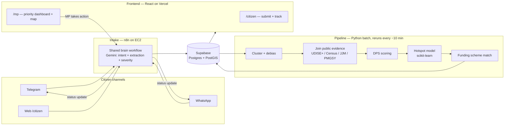
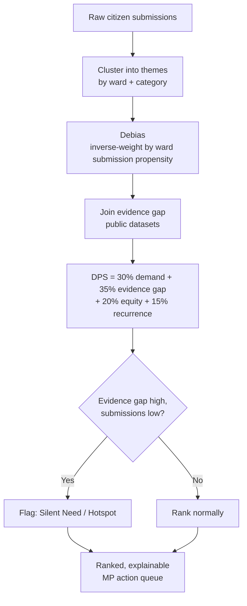

<p align="center">
  
</p>

<p align="center">
  
  
  
  
  
  
  
</p>

**An AI platform where any citizen can raise a local need in their own
language — by voice, text, or photo, over WhatsApp/Telegram/web — and
their MP gets a ranked, evidence-backed, budget-ready list of
development works to act on.**

Most civic complaint apps just count votes. Awaaz doesn't: a pothole
with 60 loud complaints and a water connection gap with 6 quiet ones
both reach the MP's desk — but the second one might outrank the first,
because the platform weighs **evidence, equity, and who never got
heard**, not just who shouted the most.

---

## Try it in under a minute

The dashboard runs entirely against mock data — no Supabase, no n8n,
no API keys needed to see it working.

```bash
cd frontend
npm install
npm run dev
```

Open the printed `localhost` URL → pick **MP View** (passcode `MP1234`)
to see the priority queue, evidence breakdown, and ward hotspot map, or
**Client View** to submit a report and watch it enter the queue.

(Wiring this up to the real Telegram/WhatsApp/Supabase backend is a
separate, optional step — see [Full stack setup](#full-stack-setup)
below. Nothing about seeing the product working requires it.)

---

## What Awaaz does

- **Meets citizens where they are** — Telegram, WhatsApp, or a web
  form; text, voice note, or photo; Hindi, English, or code-mixed.
  One shared intake brain handles all of it with a single Gemini call
  per message (intent, multi-issue split, severity, ack, ward guess).
- **Scores by evidence, not volume** — the Decision Priority Score
  (DPS) blends citizen demand with public dataset evidence (UDISE+,
  Census, JJM, PMGSY), an equity weight, and recurrence — see
  [the scoring engine](#the-scoring-engine) below.
- **Surfaces silent needs** — wards with strong documented need but
  almost no submissions (the people least likely to be online, literate,
  or comfortable calling in) get flagged instead of falling to the
  bottom of a popularity-sorted list.
- **Shows its work** — every ranked item ships with a plain-language
  explanation of *why* it's ranked where it is, so an MP's office can
  defend the priority list, not just trust it.
- **Closes the loop** — when an MP takes an issue up, the citizen who
  raised it gets notified back on the same channel they used.

---

## How it works



LLMs parse, transcribe, and explain. Deterministic code decides and
ranks — the DPS formula is never left to an LLM to compute, so the
same inputs always produce the same score.

---

## The scoring engine



The "silent need" flag started as a hand-set rule. `pipeline/hotspot_model.py`
now backs it with a small working model: a scikit-learn `LinearRegression`
predicts expected submissions per ward from evidence features, and wards
where actual submissions fall well short of that prediction score as
hotspots — surfaced on the MP dashboard's ward map. It's intentionally
simple (linear, not LightGBM) because there isn't enough demo data yet
for anything heavier to be honest — see
[what's real vs. prototype](#whats-real-vs-prototype).

---

## Repo layout

```
bot/         n8n workflows: W1 telegram, W1b whatsapp, W2 web submit, W3 brain, W4 notify
pipeline/    Clustering, debiasing, DPS scoring, hotspot model, funding matcher
frontend/    React app: /citizen + /mp (+ mock_recommendations.json to build against)
db/          schema.sql — the shared contract, read this first
data/        Scheme configs (funding routes) + raw dataset downloads
scripts/     load_wards.py, generate_synthetic_submissions.py
deploy/      docker-compose (n8n + pipeline + caddy), Caddyfile, pipeline Dockerfile
infra/       Terraform: EC2 t3.small + Elastic IP in ap-south-1
```

---

## What's real vs. prototype

Being upfront about this is more convincing than pretending it's all
finished:

| Piece | Status |
|---|---|
| Multichannel intake (Telegram / WhatsApp / Web) | ✅ n8n workflows built, tested end-to-end with curl |
| LLM extraction, severity, dedupe, rate limiting | ✅ one Gemini call per message |
| DPS scoring formula | ✅ implemented, deterministic |
| Silent-need / hotspot detection | ✅ basic scikit-learn model, runs offline, output committed |
| MP dashboard + citizen portal | ✅ full React app, works standalone against mock data |
| Ward hotspot map | ✅ working (Leaflet + OpenStreetMap, no API key) |
| Real Jaipur ward boundaries | ⏳ placeholder illustrative polygons — real GeoJSON never downloaded (see `data/README.md`) |
| Live backend (Supabase + EC2 + n8n) | ⏳ fully documented in `deploy/README.md`, not currently deployed |
| WhatsApp production credentials | ⏳ requires Meta app review |

---

## Full stack setup

For the real intake → pipeline → Supabase → dashboard loop (not just
the frontend-only quick start above):

1. Create the Supabase project, run `db/schema.sql`, enable the PostGIS
   extension, create a public `media` storage bucket.
2. Load Jaipur wards: `python scripts/load_wards.py data/raw/wards.geojson`
   (see `data/README.md` for the download source).
3. Confirm wards render on a blank Leaflet map. Then split into tracks —
   each folder README has a build order that does NOT block on the others.
4. In parallel, one person: start the Meta developer app + WhatsApp test
   number (day-one task — only step with external approval uncertainty)
   and run `infra/` Terraform (see `deploy/README.md` for the full runbook).

### Tracks

| Track | Folder | Starts with |
|---|---|---|
| Intake (bot) | `bot/` | W3 + W2 text-only, tested with curl |
| Pipeline | `pipeline/` | `generate_synthetic_submissions.py`, don't wait for real data |
| Data + funding | `data/` | Scheme configs + evidence ingestion — zero dependencies |
| Dashboard | `frontend/` | Build against the mock JSON, swap to Supabase last |

### Environment

Copy `.env.example` to `.env`: `DATABASE_URL`, `TELEGRAM_BOT_TOKEN`,
`WHATSAPP_TOKEN`, `GEMINI_API_KEY`, `SUPABASE_URL`, `SUPABASE_ANON_KEY`.

---

## Roadmap

- [ ] Download and load real Jaipur ward boundaries (DataMeet / OpenCity)
- [ ] Deploy the full stack (Supabase + EC2 + Vercel) and drop the live URL here
- [ ] Replace the offline linear-regression hotspot model with a
      real trained model once genuine submission volume exists
- [ ] WhatsApp production access (Meta app review)
- [ ] Expand evidence sources beyond the eight demo wards

---

<p align="center">
  <sub>Built for a hackathon. Awaaz (आवाज़) means "voice" — the whole point is that no one goes unheard just because they couldn't shout the loudest.</sub>
</p>
